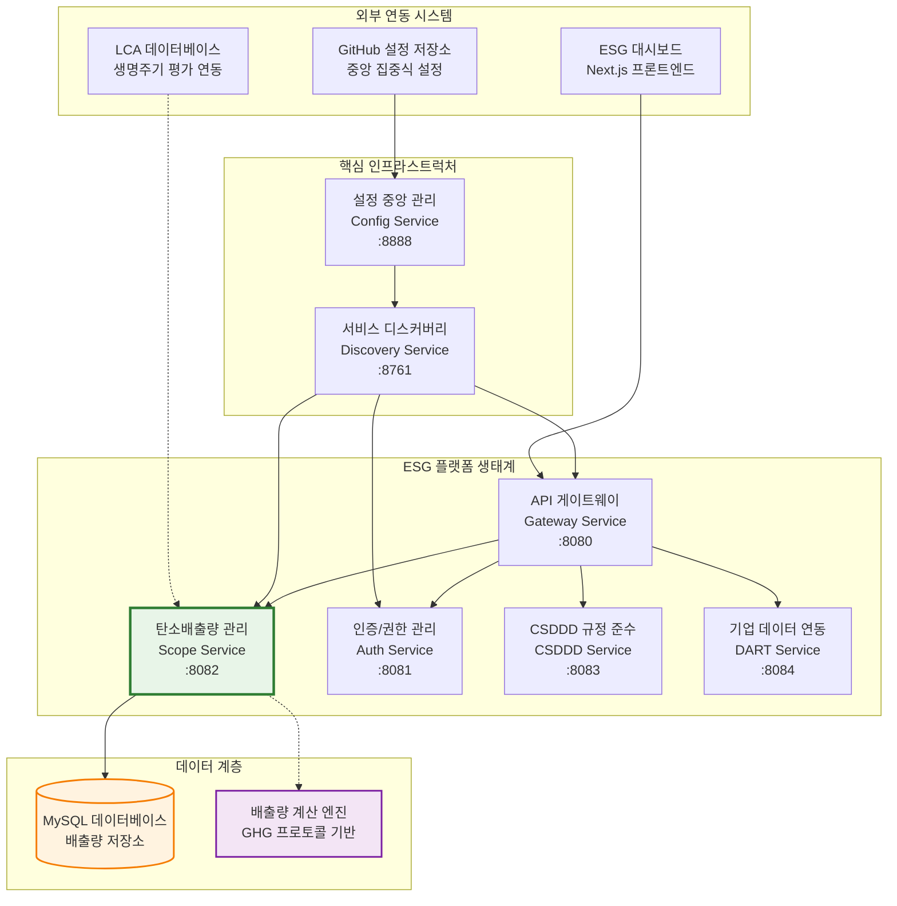
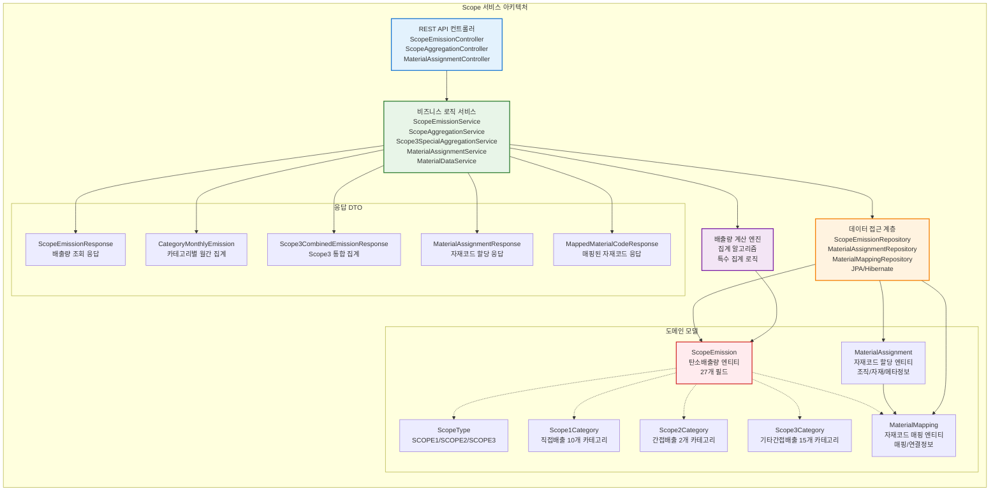
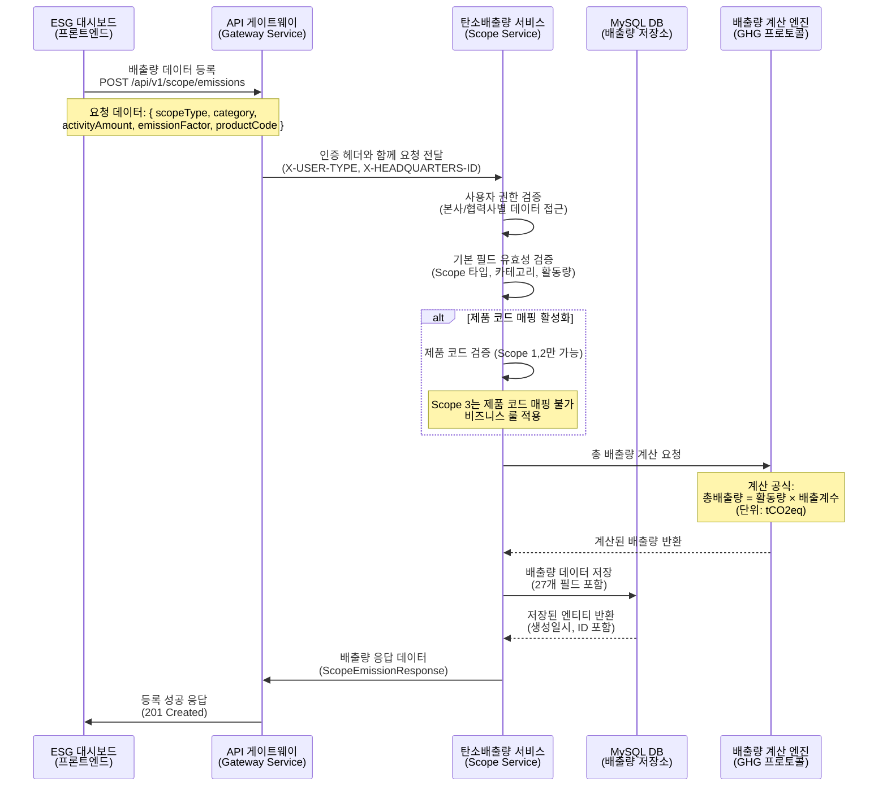
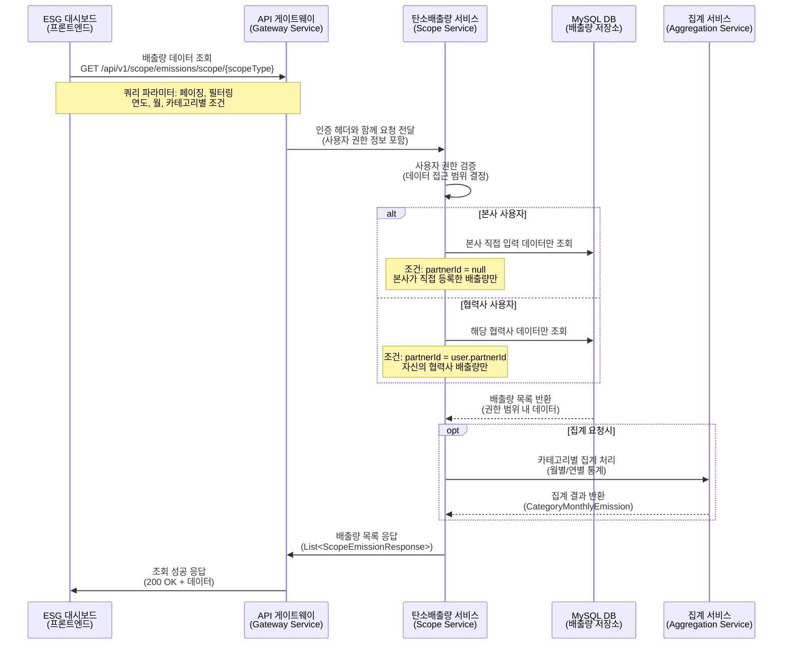
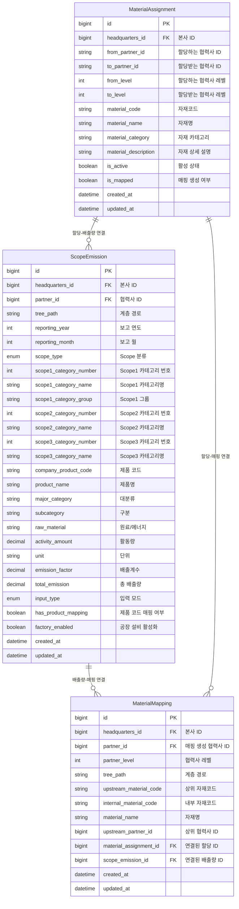
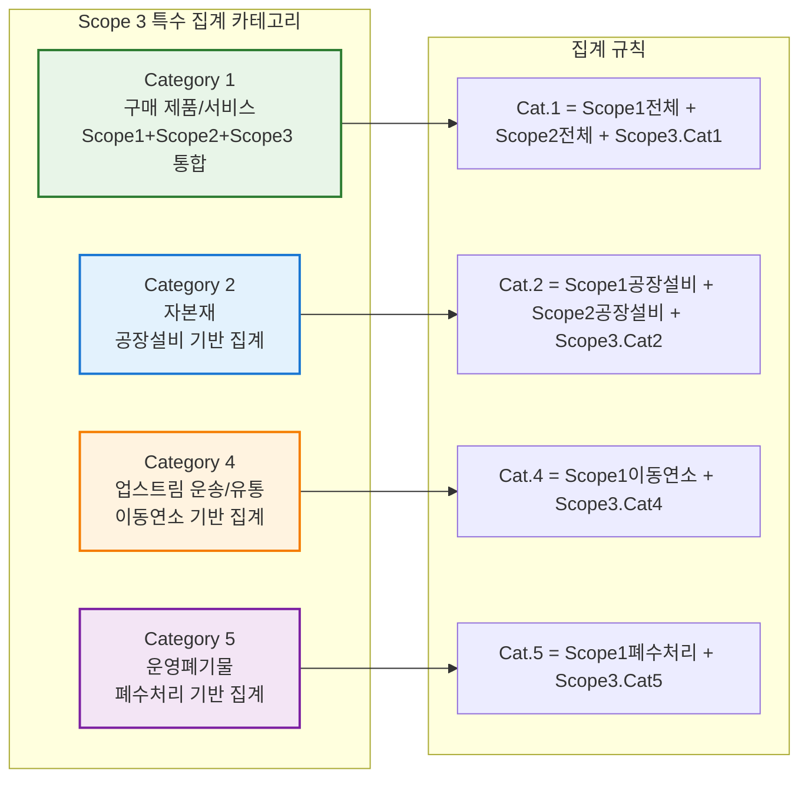
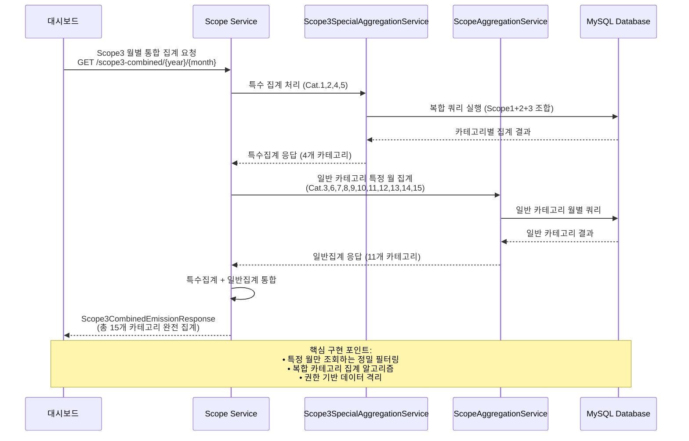
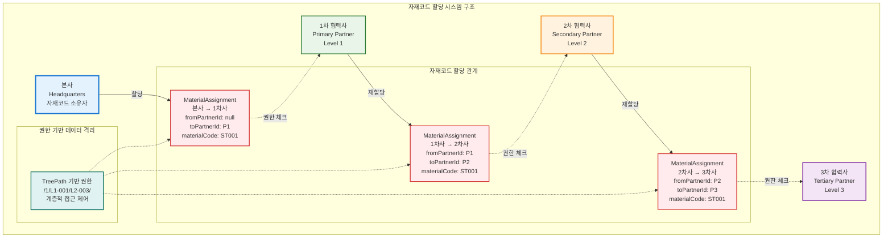

# Scope Service - GHG 온실가스 배출량 계산 및 관리 시스템

**포트폴리오 프로젝트**: ESG 플랫폼 - Scope 1/2/3 탄소배출량 관리 서비스

## 프로젝트 개요

Scope Service는 GHG(온실가스) 프로토콜에 따른 **Scope 1, 2, 3 탄소배출량 계산 및 관리**를 담당하는 마이크로서비스입니다. 기업의 직접배출, 간접배출, 기타간접배출을 체계적으로 관리하며 ESG 경영에 필수적인 탄소발자국 추적 시스템을 제공합니다.

### 핵심 기능

- **통합 Scope 관리**: Scope 1(직접배출), Scope 2(간접배출-에너지), Scope 3(기타간접배출) 통합 관리
- **카테고리별 배출량 계산**: Scope별 세부 카테고리 기반 정밀 배출량 산정
- **자재코드 관리 시스템**: 협력사 간 자재코드 할당, 매핑, 추적을 통한 공급망 탄소발자국 관리
- **계층적 자재 할당**: TreePath 기반 본사→협력사 자재코드 할당 및 권한 관리
- **매핑 기반 배출량 추적**: 자재코드와 Scope 배출량 연동을 통한 제품별 탄소발자국 추적
- **권한 기반 데이터 관리**: 본사/협력사 계층적 권한으로 조직별 배출량 데이터 관리
- **실시간 집계**: 월별/연별 배출량 통계 및 트렌드 분석

### 기술 스택

[](https://spring.io/projects/spring-boot)
[](https://openjdk.java.net/)
[](https://www.mysql.com/)
[](https://spring.io/projects/spring-cloud)
[](https://swagger.io/)
[](https://gradle.org/)


## 시스템 아키텍처

### 마이크로서비스 구조



### Scope 서비스 내부 구조



## GHG 프로토콜 Scope 분류

### Scope 카테고리 구조

```mermaid
graph TD
    subgraph "GHG 프로토콜 기반 Scope 분류 체계"
        SCOPE1[🔥 Scope 1: 직접배출<br/>Direct Emissions<br/>조직이 소유하거나 통제하는<br/>배출원에서 발생<br/>10개 카테고리]
        SCOPE2[⚡ Scope 2: 간접배출-에너지<br/>Energy Indirect Emissions<br/>구매한 전력, 스팀, 열,<br/>냉각으로 인한 배출<br/>2개 카테고리]
        SCOPE3[🌍 Scope 3: 기타간접배출<br/>Other Indirect Emissions<br/>조직 가치사슬 상의<br/>모든 기타 간접배출<br/>15개 카테고리]
        
        subgraph "🔥 Scope 1 상세 카테고리"
            S1_1[1. 고정연소<br/>Stationary Combustion<br/>보일러, 용광로 등]
            S1_2[2. 이동연소<br/>Mobile Combustion<br/>회사 차량, 선박 등]
            S1_3[3. 공정배출<br/>Process Emissions<br/>화학반응, 제조공정]
            S1_4[4. 냉매누출<br/>Fugitive Emissions<br/>냉매가스 누출]
            S1_5[5. 폐기물처리<br/>Waste Treatment<br/>폐수, 폐기물 처리]
            S1_MORE[6~10. 기타<br/>토지이용, 산림, 농업 등]
        end
        
        subgraph "⚡ Scope 2 상세 카테고리"
            S2_1[1. 구매 전력<br/>Purchased Electricity<br/>전력회사에서 구매한 전력]
            S2_2[2. 구매 열에너지<br/>Purchased Heat/Steam<br/>지역난방, 산업용 스팀]
        end
        
        subgraph "🌍 Scope 3 상세 카테고리 (업스트림)"
            S3_1[1. 구매 제품/서비스<br/>Purchased Goods & Services<br/>원료, 부품, 소모품]
            S3_2[2. 자본재<br/>Capital Goods<br/>설비, 장비, 인프라]
            S3_3[3. 연료/에너지 관련<br/>Fuel & Energy Activities<br/>연료 채굴, 운송, 정제]
            S3_4[4. 업스트림 운송/유통<br/>Upstream Transportation<br/>구매 제품 운송]
            S3_5[5. 운영폐기물<br/>Waste in Operations<br/>사업장 폐기물 처리]
            S3_6[6. 출장<br/>Business Travel<br/>직원 출장 교통수단]
            S3_7[7. 직원 통근<br/>Employee Commuting<br/>직원 출퇴근 교통수단]
            S3_8[8. 업스트림 리스자산<br/>Upstream Leased Assets<br/>임차 자산 운영]
        end
        
        subgraph "🌍 Scope 3 상세 카테고리 (다운스트림)"
            S3_9[9. 다운스트림 운송/유통<br/>Downstream Transportation<br/>판매 제품 운송]
            S3_10[10. 판매제품 가공<br/>Processing of Sold Products<br/>중간재 가공]
            S3_11[11. 판매제품 사용<br/>Use of Sold Products<br/>제품 사용단계 배출]
            S3_12[12. 판매제품 폐기<br/>End-of-Life Treatment<br/>제품 폐기 처리]
            S3_13[13. 다운스트림 리스자산<br/>Downstream Leased Assets<br/>임대 자산 운영]
            S3_14[14. 프랜차이즈<br/>Franchises<br/>프랜차이즈 운영]
            S3_15[15. 투자<br/>Investments<br/>투자 포트폴리오 배출]
        end
        
        SCOPE1 --> S1_1
        SCOPE1 --> S1_2
        SCOPE1 --> S1_3
        SCOPE1 --> S1_4
        SCOPE1 --> S1_5
        SCOPE1 --> S1_MORE
        
        SCOPE2 --> S2_1
        SCOPE2 --> S2_2
        
        SCOPE3 --> S3_1
        SCOPE3 --> S3_2
        SCOPE3 --> S3_3
        SCOPE3 --> S3_4
        SCOPE3 --> S3_5
        SCOPE3 --> S3_6
        SCOPE3 --> S3_7
        SCOPE3 --> S3_8
        SCOPE3 --> S3_9
        SCOPE3 --> S3_10
        SCOPE3 --> S3_11
        SCOPE3 --> S3_12
        SCOPE3 --> S3_13
        SCOPE3 --> S3_14
        SCOPE3 --> S3_15
    end
    
    style SCOPE1 fill:#ffebee,stroke:#d32f2f,stroke-width:3px
    style SCOPE2 fill:#f3e5f5,stroke:#7b1fa2,stroke-width:3px
    style SCOPE3 fill:#e8f5e8,stroke:#2e7d32,stroke-width:3px
    
    style S1_1 fill:#ffcdd2
    style S1_2 fill:#ffcdd2
    style S1_3 fill:#ffcdd2
    style S1_4 fill:#ffcdd2
    style S1_5 fill:#ffcdd2
    style S1_MORE fill:#ffcdd2
    
    style S2_1 fill:#e1bee7
    style S2_2 fill:#e1bee7
    
    style S3_1 fill:#c8e6c9
    style S3_2 fill:#c8e6c9
    style S3_3 fill:#c8e6c9
    style S3_4 fill:#c8e6c9
    style S3_5 fill:#c8e6c9
    style S3_6 fill:#c8e6c9
    style S3_7 fill:#c8e6c9
    style S3_8 fill:#c8e6c9
    style S3_9 fill:#a5d6a7
    style S3_10 fill:#a5d6a7
    style S3_11 fill:#a5d6a7
    style S3_12 fill:#a5d6a7
    style S3_13 fill:#a5d6a7
    style S3_14 fill:#a5d6a7
    style S3_15 fill:#a5d6a7
```



## 배출량 계산 플로우

### 배출량 등록 시퀀스



### 배출량 조회 시퀀스



## 데이터 모델

### 핵심 엔티티 구조



### Scope 카테고리 매핑

| Scope Type | 카테고리 수 | 설명 | 자재코드 매핑 |
|------------|-------------|------|----------------|
| **Scope 1** | 10개 | 직접배출 (고정연소, 이동연소, 공정배출, 냉매누출) | 지원 |
| **Scope 2** | 2개 | 간접배출-에너지 (전력, 스팀/열) | 지원 |
| **Scope 3** | 15개 | 기타간접배출 (구매 제품/서비스, 자본재, 투자 등) | 미지원 |

### 자재코드 관리 엔티티 관계

| 엔티티 | 목적 | 주요 필드 | 관계 |
|--------|------|-----------|------|
| **MaterialAssignment** | 협력사 간 자재코드 할당 관리 | materialCode, fromPartnerId, toPartnerId, isMapped | OneToMany → MaterialMapping |
| **MaterialMapping** | Scope 계산 시 자재코드 매핑 | upstreamMaterialCode, internalMaterialCode, scopeEmissionId | ManyToOne → MaterialAssignment |
| **ScopeEmission** | 탄소배출량 데이터 + 자재코드 연결 | companyProductCode, hasProductMapping | ManyToOne → MaterialMapping |

## 보안 및 권한

### 계층적 권한 시스템

- **TreePath 기반**: `/1/L1-001/L2-003/` 형식의 계층 구조
- **본사 권한**: 자신의 본사 데이터만 조회/수정 (하위 협력사 데이터 제외)
- **협력사 권한**: 자신의 협력사 데이터만 조회/수정
- **데이터 격리**: 조직별 완전 분리된 배출량 데이터 관리

### API 보안 헤더

```
X-USER-TYPE: HEADQUARTERS | PARTNER
X-HEADQUARTERS-ID: {본사ID}
X-PARTNER-ID: {협력사ID} (협력사인 경우)
X-TREE-PATH: {계층경로}
X-ACCOUNT-NUMBER: {계정번호}
```

## Scope 3 특수 집계 시스템 

### 고급 집계 알고리즘

Scope Service는 **Scope 3 카테고리별 특수 집계 시스템**을 구현하여 복잡한 비즈니스 요구사항을 충족합니다.

#### 특수 집계 대상 카테고리



#### 월별 통합 집계 플로우



## 자재코드 관리 시스템

Scope Service는 **협력사 간 자재코드 할당 및 매핑 관리 시스템**을 구현하여 공급망 전체의 탄소발자국 추적을 지원합니다.

### 자재코드 할당 시스템



### 자재코드 매핑 시스템

```mermaid
sequenceDiagram
    participant 협력사 as 협력사<br/>(Partner)
    participant API as Material API<br/>(MaterialAssignmentController)
    paragraph 매핑서비스 as MaterialMapping<br/>Service
    participant DB as MySQL DB<br/>(material_mapping)
    participant 배출량 as ScopeEmission<br/>(연결된 배출량 데이터)

    협력사->>API: 자재코드 매핑 요청<br/>POST /scope/material-mapping
    Note over 협력사,API: 요청 데이터: { upstreamMaterialCode: "ST001",<br/>internalMaterialCode: "B100", materialName: "철강재" }
    
    API->>매핑서비스: 매핑 생성 요청<br/>(사용자 권한 검증 포함)
    
    매핑서비스->>매핑서비스: 할당 검증<br/>(ST001이 해당 협력사에게 할당되었는지 확인)
    
    alt 할당된 자재코드인 경우
        매핑서비스->>DB: MaterialMapping 엔티티 생성<br/>(upstreamMaterialCode, internalMaterialCode 매핑)
        DB-->>매핑서비스: 매핑 엔티티 저장 완료
        
        매핑서비스->>매핑서비스: MaterialAssignment.isMapped = true 업데이트<br/>(할당 상태를 매핑됨으로 변경)
        
        opt Scope 배출량 계산 연동
            매핑서비스->>배출량: ScopeEmission과 연결<br/>(materialMapping 필드 설정)
            배출량-->>매핑서비스: 배출량 데이터 연결 완료
        end
        
        매핑서비스-->>API: 매핑 성공 응답<br/>(MaterialMappingResponse)
        API-->>협력사: 201 Created<br/>매핑 생성 완료
        
    else 할당되지 않은 자재코드인 경우
        매핑서비스-->>API: 권한 오류<br/>(해당 자재코드가 할당되지 않음)
        API-->>협력사: 403 Forbidden<br/>매핑 권한 없음
    end
    
    Note over 협력사,배출량: 핵심 구현 포인트:<br/>• 할당된 자재코드만 매핑 가능<br/>• TreePath 기반 권한 검증<br/>• Scope 배출량과 자동 연결
```

### 더미 데이터 시스템

MaterialDataService는 **현대자동차 기준 자동차 제조업 특화 더미 데이터**를 제공합니다.

#### 자재 카테고리별 더미 데이터 (총 16개)

| 카테고리 | 자재 수 | 자재코드 예시 | 설명 |
|----------|---------|---------------|------|
| **강재** | 4개 | ST001, ST002, ST003, ST004 | 냉간압연강판, 열간압연강판, 고장력강판, 스테인리스강 |
| **비철금속** | 3개 | AL001, CU001, ZN001 | 알루미늄합금, 구리선재, 아연도금강판 |
| **플라스틱** | 2개 | PL001, PL002 | ABS수지, 폴리프로필렌 |
| **고무** | 1개 | RB001 | 타이어고무 |
| **전자부품** | 2개 | BT001, SC001 | 리튬배터리, 반도체칩 |
| **화학원료** | 2개 | PA001, AD001 | 자동차도료, 구조용접착제 |
| **유리** | 1개 | GL001 | 강화유리 |
| **텍스타일** | 1개 | TX001 | 시트원단 |


## API 문서

### 주요 엔드포인트

#### 배출량 관리 API

| HTTP Method | Endpoint | 설명 | 인증 | 응답 |
|-------------|----------|------|------|------|
| POST | `/api/v1/scope/emissions` | 배출량 데이터 생성 | 필요 | ScopeEmissionResponse |
| GET | `/api/v1/scope/emissions/scope/{scopeType}` | Scope별 배출량 조회 | 필요 | List<ScopeEmissionResponse> |
| PUT | `/api/v1/scope/emissions/{id}` | 배출량 데이터 수정 | 필요 | ScopeEmissionResponse |
| DELETE | `/api/v1/scope/emissions/{id}` | 배출량 데이터 삭제 | 필요 | Success Message |

#### 집계 API

| HTTP Method | Endpoint | 설명 | 인증 | 응답 |
|-------------|----------|------|------|------|
| GET | `/api/v1/scope/aggregation/partner/{partnerId}/year/{year}/monthly-summary` | **협력사별 월별 배출량 집계** | 필요 | List\<MonthlyEmissionSummary\> |
| GET | `/api/v1/scope/aggregation/category/{scopeType}/year/{year}` | **카테고리별 연간 배출량 집계** | 필요 | List\<CategoryYearlyEmission\> |
| GET | `/api/v1/scope/aggregation/category/{scopeType}/year/{year}/monthly` | **카테고리별 월간 배출량 집계** (연도 전체) | 필요 | List\<CategoryMonthlyEmission\> |
| GET | `/api/v1/scope/aggregation/scope3-special/{year}/{month}` | **Scope 3 특수 집계** (Cat.1,2,4,5) | 필요 | Scope3SpecialAggregationResponse |
| GET | `/api/v1/scope/aggregation/scope3-combined/{year}/{month}` | **Scope 3 월별 통합 집계** (특수+일반) | 필요 | Scope3CombinedEmissionResponse |
| GET | `/api/v1/scope/aggregation/scope3-combined/{year}` | **Scope 3 연별 통합 집계** (특수+일반) | 필요 | Scope3CombinedEmissionResponse |

#### 자재코드 할당 관리 API

| HTTP Method | Endpoint | 설명 | 인증 | 응답 |
|-------------|----------|------|------|------|
| **조회 API** |
| GET | `/api/v1/scope/material-assignments/partner/{partnerId}` | **협력사별 할당된 자재코드 조회** | 필요 | List\<MaterialAssignmentResponse\> |
| GET | `/api/v1/scope/material-assignments/headquarters` | **본사별 모든 자재코드 할당 조회** | 필요 | List\<MaterialAssignmentResponse\> |
| GET | `/api/v1/scope/material-assignments/my-materials` | **내 자재 데이터 조회** (본사: 더미데이터, 협력사: 할당데이터) | 필요 | List\<MaterialAssignmentResponse\> |
| **생성 API** |
| POST | `/api/v1/scope/material-assignments` | **자재코드 할당 생성** | 필요 | MaterialAssignmentResponse |
| POST | `/api/v1/scope/material-assignments/batch` | **자재코드 일괄 할당** | 필요 | List\<MaterialAssignmentResponse\> |
| **수정/삭제 API** |
| PUT | `/api/v1/scope/material-assignments/{assignmentId}` | **자재코드 할당 수정** | 필요 | MaterialAssignmentResponse |
| GET | `/api/v1/scope/material-assignments/{assignmentId}/can-delete` | **자재코드 할당 삭제 가능 여부 확인** | 필요 | Map\<String, Object\> |
| DELETE | `/api/v1/scope/material-assignments/{assignmentId}` | **자재코드 할당 삭제** | 필요 | Success Message |
| **매핑 관리 API** |
| GET | `/api/v1/scope/material-assignments/mappable` | **매핑 가능한 자재코드 할당 조회** | 필요 | List\<MaterialAssignmentResponse\> |
| GET | `/api/v1/scope/material-assignments/{assignmentId}/mapping-status` | **자재코드 할당 매핑 상태 조회** | 필요 | Map\<String, Object\> |
| GET | `/api/v1/scope/material-assignments/mapping-statistics` | **협력사 매핑 통계 조회** | 필요 | Map\<String, Object\> |

#### 최신 추가 기능 (Version 1.5)

| 기능 | 설명 | 기술적 구현 | 비즈니스 가치 |
|------|------|-------------|----------------|
| **특정 월 정밀 조회** | 요청한 월의 데이터만 정확히 반환 | `getCategorySpecificMonthEmissions()` 메서드 구현 | 월별 성과 추적 정밀도 향상 |
| **Scope 3 특수 집계** | 복합 카테고리 집계 알고리즘 | Cat.1,2,4,5의 Scope간 교차 집계 | GHG 프로토콜 고급 요구사항 대응 |
| **통합 배출량 시스템** | 특수+일반 카테고리 완전 통합 | `Scope3CombinedEmissionResponse` 설계 | 전사 탄소배출량 완전 가시성 |
| **계층적 권한 집계** | TreePath 기반 데이터 격리 | Repository 레벨 권한 필터링 | 조직별 보안 데이터 관리 |
| **자재코드 할당 시스템** | 협력사 간 자재코드 할당 및 관리 | MaterialAssignment 엔티티 + 11개 API | 공급망 탄소발자국 추적 |
| **자재코드 매핑 시스템** | Scope 배출량과 자재코드 연동 | MaterialMapping 엔티티 + 권한 기반 매핑 | 제품별 정밀 배출량 계산 |
| **더미 데이터 시스템** | 본사용 16개 자재 더미 데이터 | MaterialDataService + 자동차 제조업 특화 | 시스템 테스트 및 데모 지원 |

### Swagger UI

서비스 실행 후 `http://localhost:8082/swagger-ui.html`에서 API 문서 확인 가능

## 실행 방법

### 개발 환경 구성

```bash
# 핵심 서비스 시작
./backend/run-core-services.sh

# Scope 서비스 실행
cd backend/scope-service
./gradlew bootRun
```

### 환경 변수 설정

```yaml
# application.yml
spring:
  application:
    name: scope-service
  config:
    import: optional:configserver:http://localhost:8888

server:
  port: 8082

# Swagger 설정
springdoc:
  api-docs:
    path: /api-docs
  swagger-ui:
    path: /swagger-ui.html
    operations-sorter: method
```

## 테스트

```bash
# 단위 테스트 실행
./gradlew test

# 통합 테스트 실행
./gradlew integrationTest

# 배출량 계산 검증 테스트
./gradlew calculationTest
```

## 핵심 구현 특징

### 1. GHG 프로토콜 준수

- **표준 Scope 분류**: GHG 프로토콜 표준에 따른 Scope 1/2/3 분류
- **카테고리 관리**: 각 Scope별 세부 카테고리 체계적 관리
- **배출계수 적용**: 국가 및 국제 표준 배출계수 적용

### 2. 제품별 탄소발자국 추적

```java
// Scope 1, 2에서만 제품 코드 매핑 지원
if (Boolean.TRUE.equals(request.getHasProductMapping())) {
    if (request.getScopeType() == ScopeType.SCOPE3) {
        throw new IllegalArgumentException("Scope 3는 제품 코드 매핑을 설정할 수 없습니다");
    }
    // 제품별 배출량 추적 로직
}
```

### 3. 데이터 무결성 보장

```java
@PrePersist
@PreUpdate
private void validateInputData() {
    // 배출량 계산 검증
    BigDecimal calculated = activityAmount.multiply(emissionFactor);
    if (totalEmission.compareTo(calculated) != 0) {
        throw new IllegalStateException("배출량 계산이 일치하지 않습니다");
    }
}
```

### 4. 성능 최적화 인덱스

```sql
-- 주요 인덱스 전략
CREATE INDEX idx_scope_year_month ON scope_emission(headquarters_id, reporting_year, reporting_month);
CREATE INDEX idx_scope_category ON scope_emission(scope_type, scope1_category_number, scope2_category_number, scope3_category_number);
CREATE INDEX idx_product_code ON scope_emission(headquarters_id, company_product_code, reporting_year, reporting_month);
```

### 핵심 구현 성과

#### 1. **복합 집계 알고리즘 설계** 
- **Scope 3 특수 집계 시스템**: 4개 카테고리에 대한 Scope간 교차 집계 로직 구현
- **정밀 월별 필터링**: 특정 월만 조회하는 고성능 쿼리 최적화
- **계층적 권한 기반 집계**: TreePath 알고리즘을 활용한 조직별 데이터 격리

#### 2. **GHG 프로토콜 완전 준수**
- **27개 카테고리 체계**: Scope 1(10개) + Scope 2(2개) + Scope 3(15개) 완전 구현
- **국제 표준 배출계수**: BigDecimal 기반 정밀 계산으로 tCO2eq 단위 정확도 보장
- **자재코드 기반 탄소발자국**: 공급망 자재코드 할당 및 매핑을 통한 제품별 배출량 추적

#### 5. **자재코드 관리 시스템 구현**
- **계층적 할당 시스템**: 본사→1차→2차→3차 협력사 자재코드 할당 체계 구현
- **중복 검증 로직**: MaterialAssignment 테이블 기반 자재코드 중복 할당 방지
- **TreePath 기반 권한 관리**: `/1/L1-001/L2-003/` 형식의 계층적 접근 제어 시스템
- **매핑 상태 추적**: isMapped 플래그를 통한 자재코드 사용 현황 실시간 추적

#### 3. **마이크로서비스 아키텍처**
- **Spring Boot 3.5.0**: 최신 프레임워크 기반 RESTful API 설계
- **Spring Cloud**: Config Server, Eureka, Gateway를 활용한 분산 시스템
- **MySQL + JPA**: 대용량 시계열 데이터 최적화 및 복합 인덱스 설계

#### 4. **엔터프라이즈급 보안**
- **JWT 기반 인증**: HttpOnly 쿠키로 XSS 방지
- **다계층 권한 시스템**: 본사/협력사별 완전 데이터 격리
- **API 레벨 권한 검증**: 메소드 레벨 @PreAuthorize 적용

### 기술적 도전과 해결

| 도전 과제 | 해결 방안 | 기술적 성과 |
|-----------|-----------|-------------|
| **복잡한 Scope 3 집계** | 특수집계 서비스 분리 설계 | Cat.1,2,4,5의 교차 집계 알고리즘 구현 |
| **월별 정밀 조회** | Repository 레벨 필터링 최적화 | 요청 월만 정확히 반환하는 쿼리 설계 |
| **대용량 데이터 처리** | 인덱스 전략 및 페이징 최적화 | 연도별 파티셔닝으로 성능 향상 |
| **권한 기반 집계** | TreePath 알고리즘 활용 | 조직 계층별 완전 데이터 격리 달성 |
| **계층적 자재코드 할당** | MaterialAssignment 엔티티 설계 | 본사→협력사 다단계 할당 체계 구현 |
| **자재코드 중복 방지** | 복합 유니크 인덱스 + 비즈니스 로직 | materialCode + toPartnerId 중복 할당 완전 차단 |
| **공급망 권한 관리** | TreePath 기반 계층적 검증 | 할당 받은 자재코드만 매핑 가능한 보안 체계 |


**Scope Service Version 2** - 자재코드 관리 시스템 추가 

